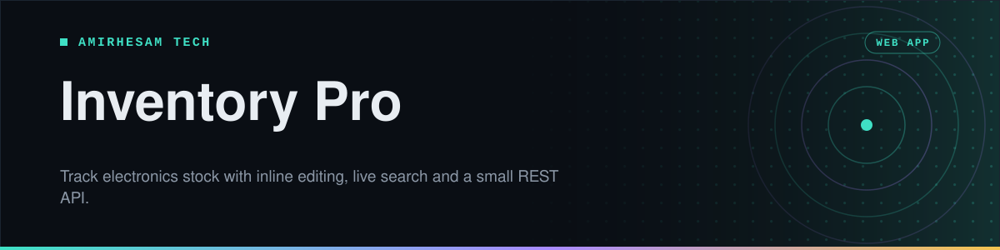

<p align="center">
  
</p>

<p align="center">
  
  
  
  
  
  <a href="https://github.com/amirh3sam/inventory-app/stargazers"></a>
</p>

<p align="center">
  <a href="#quick-start"><b>Quick start</b></a> ·
  <a href="#using-it">Using it</a> ·
  <a href="#the-api">The API</a> ·
  <a href="#deploying">Deploying</a> ·
  <a href="#faq">FAQ</a>
</p>

Most inventory tools want an account, a subscription and a week of setup before they will tell you how many HDMI cables are in the cupboard.

This one is a single Node process and a file. Run it, open the page, start typing. The data lives in a SQLite file next to the code, which means there is no database server to install and a backup is a file copy.

- **Edit in place.** Click a cell, change it, press Enter. There is no edit form and no separate page.
- **Search as you type**, filtering the whole table while you type.
- **A real REST API underneath**, so the same data is reachable from scripts or any other tool.
- **No build step.** Plain HTML, CSS and JavaScript on the front, Express on the back.

## Quick start

You need **Node.js 18 or newer**.

```bash
git clone https://github.com/amirh3sam/inventory-app.git
cd inventory-app
npm install
npm start
```

Open **http://localhost:3000**.

The database file is created on first run, so there is nothing to set up. For development with automatic restarts:

```bash
npm run dev
```

## Using it

Each item carries the fields you actually need to find a thing again:

| Field | What it holds |
|---|---|
| `name` | What the item is |
| `manufacturer` | Who made it |
| `model` | Model or part number |
| `quantity` | How many you have |
| `location` | Where it is: shelf, drawer, room |
| `description` | Anything else worth writing down |

**Adding** is a short form at the top. **Editing** happens in the table itself, no form involved. **Searching** filters as you type across every field, so a shelf name finds everything on that shelf. **Deleting** asks first.

> [!TIP]
> `location` is the field that earns its keep. Six months from now you will not remember where you put something, and a consistent naming scheme such as `Shelf B / Bin 3` makes the search genuinely useful.

## The API

The browser page is just one client. Everything it does is available over HTTP.

| Method | Path | What it does |
|---|---|---|
| `GET` | `/api/items` | Every item |
| `POST` | `/api/items` | Add an item |
| `PUT` | `/api/items/:id` | Update an item |
| `DELETE` | `/api/items/:id` | Remove an item |

<details>
<summary><b>Examples</b></summary>

List everything:

```bash
curl http://localhost:3000/api/items
```

Add an item:

```bash
curl -X POST http://localhost:3000/api/items \
  -H "Content-Type: application/json" \
  -d '{
    "name": "HDMI Cable 2m",
    "manufacturer": "Generic",
    "model": "HDMI-2M",
    "quantity": 12,
    "location": "Shelf B / Bin 3",
    "description": "High speed, 4K60"
  }'
```

Update one:

```bash
curl -X PUT http://localhost:3000/api/items/1 \
  -H "Content-Type: application/json" \
  -d '{"quantity": 10}'
```

Delete one:

```bash
curl -X DELETE http://localhost:3000/api/items/1
```

</details>

CORS is enabled, so you can call the API from a page served somewhere else.

## Deploying

[`render.yaml`](render.yaml) is included, so [Render](https://render.com) picks up the build and start commands from the repository.

> [!WARNING]
> **Two lines in [`server.js`](server.js) need changing before a deploy will succeed.** Both are fine locally, which is why they are easy to miss.
>
> **1. The port is hardcoded.** Hosting platforms tell the app which port to listen on through the `PORT` environment variable, and `render.yaml` sets it to `10000`. Line 56 ignores it:
>
> ```js
> app.listen(process.env.PORT || 3000, () => {
> ```
>
> **2. There is no `/health` route**, but `render.yaml` sets `healthCheckPath: /health`. Add one before `app.listen`:
>
> ```js
> app.get("/health", (req, res) => res.json({ status: "ok" }));
> ```
>
> Without the first fix the platform cannot reach the app at all. Without the second it keeps restarting a container that is actually running fine.

Anywhere else that runs Node, the same two commands apply:

```bash
npm install
npm start
```

> [!IMPORTANT]
> SQLite writes to a file on local disk. On a platform with an ephemeral filesystem, Render's free tier included, that file is wiped on every redeploy and restart. Fine for trying it out, not fine for data you intend to keep. Attach a persistent disk, or move to Postgres, before it holds anything you would miss.

## FAQ

<details>
<summary><b>Where is my data?</b></summary>

In `database.db` in the project folder. Copy that file to back everything up, or open it with DBeaver or any SQLite tool to look inside.

</details>

<details>
<summary><b>How do I start over?</b></summary>

Stop the server, delete `database.db`, and start it again. A fresh empty table is created on boot.

</details>

<details>
<summary><b>Port 3000 is already in use</b></summary>

The port is currently written into [`server.js`](server.js) rather than read from the environment, so `PORT=3001 npm start` has no effect. Either change the number on line 56, or make it configurable once and for all:

```js
app.listen(process.env.PORT || 3000, () => {
```

</details>

<details>
<summary><b>Can I add my own fields?</b></summary>

Yes. Add the column to the `CREATE TABLE` statement in [`server.js`](server.js), include it in the `POST` and `PUT` handlers, and add the input and table cell in [`public/index.html`](public/index.html). An existing database will not gain the column by itself, so delete the file or run an `ALTER TABLE`.

</details>

<details>
<summary><b>Is there a login?</b></summary>

No. Anyone who can reach the page can change the data, so keep it on your own network unless you add authentication first.

</details>

## About

Made by **[AmirHesam Tech](https://amirhesamtech.com)**. More tech content on TikTok: [@techwithamirh3sam](https://www.tiktok.com/@techwithamirh3sam).

If this repo saved you some time, please give it a star. It helps other people find it.
